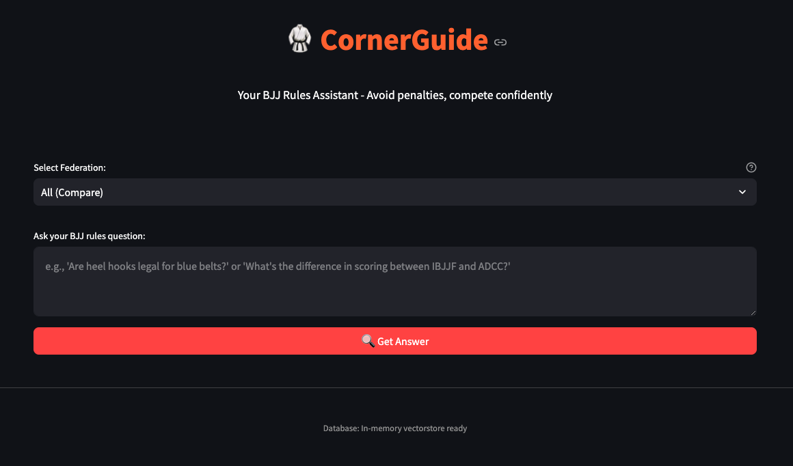

https://www.loom.com/share/26dcb55f10c6433da0fdab2c9d3bc525

# CornerGuide 🥋

**BJJ Rules Assistant - Avoid penalties, compete confidently**

An AI-powered assistant that provides instant answers about IBJJF and ADCC rules using advanced retrieval techniques and medical safety integration.

## Problem

BJJ athletes get penalized because it's overwhelming to go through full rulebooks, but they need quick answers about techniques used in daily sparring.

## Solution

Ask questions like "Are heel hooks legal for brown belts in IBJJF?" and get clear answers with rule citations and medical safety context.

## Performance Results

Advanced RAG system with 60.1% improvement in answer accuracy over baseline:

| Metric            | Score | Status        |
| ----------------- | ----- | ------------- |
| Faithfulness      | 0.730 | 🟢 Good       |
| Answer Relevancy  | 0.676 | 🟠 Acceptable |
| Context Precision | 0.912 | 🟢 Excellent  |
| Context Recall    | 0.756 | 🟢 Good       |

## Quick Start

```bash
# Setup environment
pip install -r requirements.txt
cp .env.template .env
# Add your OPENAI_API_KEY and COHERE_API_KEY to .env

# Validate installation
python validate.py

# Run application
python run.py
```

Opens at `http://localhost:8501` - PDF processing happens automatically on first run.

## Key Features

- **Advanced Retrieval**: Multi-query fusion with Cohere reranking
- **Federation Routing**: Compare IBJJF vs ADCC or query specific federations
- **Medical Integration**: Automatic PubMed research for dangerous techniques
- **Semantic Chunking**: Complete rule contexts vs broken text fragments

## Tech Stack

- **LangGraph**: Agent orchestration and workflow
- **GPT-4o + text-embedding-3-large**: Answer generation and embeddings
- **Cohere rerank-english-v3.0**: Result reranking
- **Qdrant**: In-memory vector database
- **Streamlit**: Web interface

## Example Questions

- "Are heel hooks legal for brown belts in IBJJF?"
- "What's the difference between IBJJF and ADCC scoring?"
- "Can I grab inside the gi pants during guard passing?"
- "Why are wrist locks banned for white belts?"

## Project Structure

```
cornerguide/
├── assets/              # Official PDF rulebooks
├── src/
│   ├── agents/         # Retrieval, answer generation, medical research
│   ├── extraction/     # PDF processing with strategy pattern
│   ├── orchestration/  # LangGraph workflow
│   └── evaluation/     # RAGAS evaluation pipeline
├── app.py              # Streamlit interface
├── deliverables.md     # Complete project documentation
└── validate.py         # Installation checker
```

## Documentation

See [deliverables.md](deliverables.md) for complete project documentation including all 7 deliverables and detailed evaluation results.

---

Built for BJJ athletes competing across federations who need instant, accurate rule guidance.
