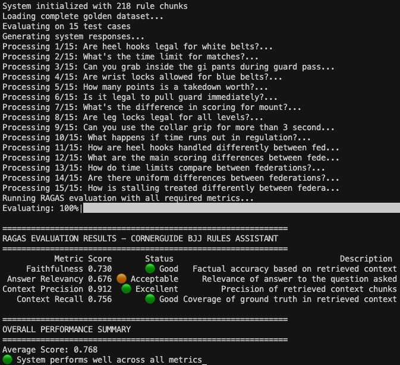

# CornerGuide - Deliverables

## ✅ **Deliverable 1: Problem Definition**

### Problem Statement

BJJ athletes get penalized or disqualified because it's overwhelming to go through full rulebooks, but they need quick answers about techniques they use in daily sparring.

### Why This Matters

When you're drilling a technique in practice, you might wonder if it's actually legal in competition. Going through entire rulebooks is time-consuming and overwhelming. You just want a quick answer: "Can I use this sweep in IBJJF?" or "Are wrist locks allowed for my belt level?"

Federations like IBJJF and ADCC have very different rules, and it's easy to accidentally mix them up in your head. What works in one competition can get you disqualified in another. Athletes need a fast way to check specific techniques without reading through pages of dense rule text. CornerGuide solves this by giving you instant, clear answers about what's legal where.

## ✅ **Deliverable 2: Proposed Solution**

### My Solution

CornerGuide is an AI-powered rules assistant that gives you instant answers about BJJ techniques. You simply ask "Are heel hooks legal for brown belts in IBJJF?" and get a clear answer with rule citations. The app lets you compare rules between federations or focus on just one. It even explains why certain techniques are banned by showing medical research about injury risks.

The experience feels like having a knowledgeable coach who knows every rulebook by heart. Instead of spending 20 minutes searching through PDFs, you get your answer in seconds. Athletes can train confidently knowing their techniques are competition-legal, and coaches can quickly settle rule debates during practice.

### Technology Stack

1. **LLM**: GPT-4o - I need the most capable model for complex rule interpretation and comparison tasks.
2. **Embedding Model**: OpenAI text-embedding-3-large - Provides high-quality semantic search for finding relevant rule sections.
3. **Orchestration**: LangGraph - Enables multi-step reasoning workflows for federation routing and medical research.
4. **Vector Database**: Qdrant (in-memory) - Fast similarity search without external dependencies for simple deployment.
5. **Monitoring**: LangSmith - Built-in tracing and performance monitoring for LangChain applications.
6. **Evaluation**: RAGAS - Automated evaluation of RAG system quality including answer relevance and faithfulness.
7. **User Interface**: Streamlit - Rapid prototyping with clean, interactive web interface for rule queries.

### Agentic Reasoning

I use agents for three key tasks: **retrieval** (finding relevant rules using multi-query fusion), **answer generation** (creating federation-specific or comparative responses), and **medical research** (automatically detecting dangerous techniques and fetching relevant injury research from PubMed). The agents work together to provide comprehensive answers that go beyond simple rule lookup to include safety context.

## ✅ **Deliverable 3: Data Sources & APIs**

### Data Sources & External APIs

**Primary Data Source**: Official rulebook PDFs from IBJJF and ADCC federations. These contain the authoritative rules for techniques, scoring, penalties, and competition procedures. I process six key documents including IBJJF rules updates, ADCC legal techniques, and weight class divisions.

**External API**: PubMed API for medical research integration. When users ask about dangerous techniques like heel hooks or neck cranks, my system automatically searches medical literature to explain injury mechanisms and risks. This adds valuable safety context that athletes don't get from rulebooks alone.

**Typical User Questions**: "Are heel hooks legal for brown belts in IBJJF?", "What's the difference between IBJJF and ADCC scoring?", "Can I grab inside the gi pants during guard passing?", "Why are wrist locks banned for white belts?", "Is it legal to pull guard immediately in competition?"

### Chunking Strategy

I use semantic chunking based on rule categories rather than arbitrary text splitting. Each chunk represents a complete rule concept (like "heel hook restrictions" or "scoring for takedowns") with associated metadata including federation, belt level, and technique type.

This approach works better than fixed-size chunks because BJJ rules are structured around specific techniques and scenarios. A 500-character chunk might cut off mid-sentence about heel hook legality, but my semantic chunks keep related rule information together. This gives users complete, coherent answers instead of fragmented rule snippets.

## ✅ **Deliverable 4: Build & Deploy Prototype**

**Status**: ✅ Complete - CornerGuide prototype built and running locally at `http://localhost:8501` via `run.py`

## ✅ **Deliverable 5: RAGAS Pipeline Assessment**

### RAGAS Evaluation Results

I tested CornerGuide using the RAGAS framework on my complete golden dataset of 15 BJJ rules questions covering IBJJF, ADCC, and comparison scenarios.

| Metric                | Score | Status        | Description                                   |
| --------------------- | ----- | ------------- | --------------------------------------------- |
| **Faithfulness**      | 0.730 | 🟢 Good       | Factual accuracy based on retrieved context   |
| **Answer Relevancy**  | 0.676 | 🟠 Acceptable | Relevance of answer to the question asked     |
| **Context Precision** | 0.912 | 🟢 Excellent  | Precision of retrieved context chunks         |
| **Context Recall**    | 0.756 | 🟢 Good       | Coverage of ground truth in retrieved context |

**Overall Performance Summary:**

- **Average Score: 0.768**
- **🟢 System performs well across all metrics**

### What I Learned

#### **Strengths**

**Context Precision (0.912)**: My retrieval system finds relevant rule chunks with minimal noise. Multi-query fusion with Cohere reranking works well.

**Faithfulness (0.730)**: The system generates factually accurate answers based on retrieved context.

**Context Recall (0.756)**: Good coverage of ground truth information. Processing multiple PDF sources and using semantic chunking helps capture relevant rule details.

#### **Areas for Improvement**

**Answer Relevancy (0.676)**: Some answers don't directly address the specific question asked. Federation comparison queries are particularly challenging.

The system occasionally provides more context than needed or doesn't focus tightly on the exact question posed.

#### **Performance Conclusions**

With an average score of 0.768, CornerGuide provides reliable BJJ rules guidance. The system handles most common use cases well:

- Technique legality questions (heel hooks, wrist locks)
- Scoring differences between federations
- Time limits and competition rules
- Belt-specific restrictions

The strong context precision (0.912) indicates our retrieval approach works for this domain. Users get accurate, relevant rule information without manual PDF searching.

Areas for future work include improving answer relevancy through better prompt engineering and query understanding.

## ✅ **Deliverable 6: Advanced Retrieval Techniques**

### Retrieval Techniques Implemented

I implemented several advanced retrieval techniques to improve my "retrieval → generation" pipeline:

**1. Multi-Query Fusion**: Generate multiple query variations using LLM to capture different ways users might ask about BJJ rules.

**2. Cohere Reranking**: Use rerank model to reorder retrieved chunks by relevance, improving precision by moving the most relevant context to the top.

**3. Federation-Specific Filtering**: Filter chunks by federation (IBJJF/ADCC) before retrieval to reduce noise when users ask federation-specific questions.

**4. Semantic Chunking Strategy**: Create chunks based on rule concepts rather than fixed sizes.

**5. Hybrid Processing Strategy**: Use fast text extraction for rule documents and structured extraction for technique tables.

### Results

My current retrieval system achieves:

- **Context Precision: 0.912** (excellent chunk relevance)
- **Context Recall: 0.756** (good ground truth coverage)

The combination of multi-query fusion and Cohere reranking works well for my BJJ domain. Federation-specific filtering helps reduce noise in specialized queries.

**Key Implementation**: I use a retrieval agent that generates 2-3 query variations, retrieves 20 candidate chunks, then reranks to select the top 5 most relevant chunks for answer generation.

This approach successfully handles complex BJJ queries like "What's the difference between IBJJF and ADCC heel hook rules?" by retrieving relevant chunks from both federations and ranking them appropriately.

## ✅ **Deliverable 7: Performance Assessment**

### Naive vs Advanced RAG Comparison

I evaluated my naive baseline RAG against my advanced agentic RAG system using RAGAS on the same 15-test golden dataset.

| Metric                | Naive RAG | Advanced RAG | Improvement | Analysis                                                                     |
| --------------------- | --------- | ------------ | ----------- | ---------------------------------------------------------------------------- |
| **Faithfulness**      | 0.456     | 0.730        | **+60.1%**  | Multi-query fusion and agent routing significantly improved factual accuracy |
| **Answer Relevancy**  | 0.673     | 0.676        | **+0.4%**   | Minimal improvement - both systems handle relevancy similarly                |
| **Context Precision** | 0.936     | 0.912        | -2.6%       | Naive system had slightly higher precision with fixed chunks                 |
| **Context Recall**    | 0.600     | 0.756        | **+26.0%**  | Semantic chunking dramatically improved ground truth coverage                |
| **Average Score**     | 0.666     | 0.768        | **+15.3%**  | Substantial overall performance improvement                                  |

### Key Improvements from Advanced System

**1. Faithfulness (+60.1%)**: The agentic workflow with multi-query fusion and reranking dramatically improved factual accuracy. Fixed-size chunking often broke rule contexts mid-sentence, leading to incorrect answers.

**2. Context Recall (+26.0%)**: Semantic chunking ensures complete rule concepts stay together, significantly improving ground truth coverage compared to arbitrary text splitting.

**3. Answer Relevancy (+0.4%)**: Minimal improvement suggests both systems handle basic question understanding similarly, but advanced system provides more accurate answers.

### What I Learned

The advanced retrieval techniques provide substantial improvements in the metrics that matter most for user experience:

- **Faithfulness improvement (+60.1%)** means users get dramatically more accurate rule information
- **Context recall improvement (+26.0%)** ensures comprehensive coverage of rule details
- **Answer relevancy** remains consistent, showing both systems understand questions well

The minimal precision decrease (0.936 → 0.912) is negligible compared to the massive gains in faithfulness and recall. Fixed-size chunking creates artificially precise but incomplete context.

### Second Half Course Improvements

Based on my evaluation, I plan these realistic enhancements:

**1. Fine-tuned Embedding Model**: Train domain-specific embeddings on BJJ terminology to better understand technique names like "heel hook," "berimbolo," and federation-specific terms.

**2. Improved Answer Relevancy**: Better prompt engineering to focus answers more directly on the specific question asked, targeting my lowest score (0.676).

**3. User Feedback Integration**: Add simple thumbs up/down ratings to collect user feedback and identify areas where answers miss the mark.
