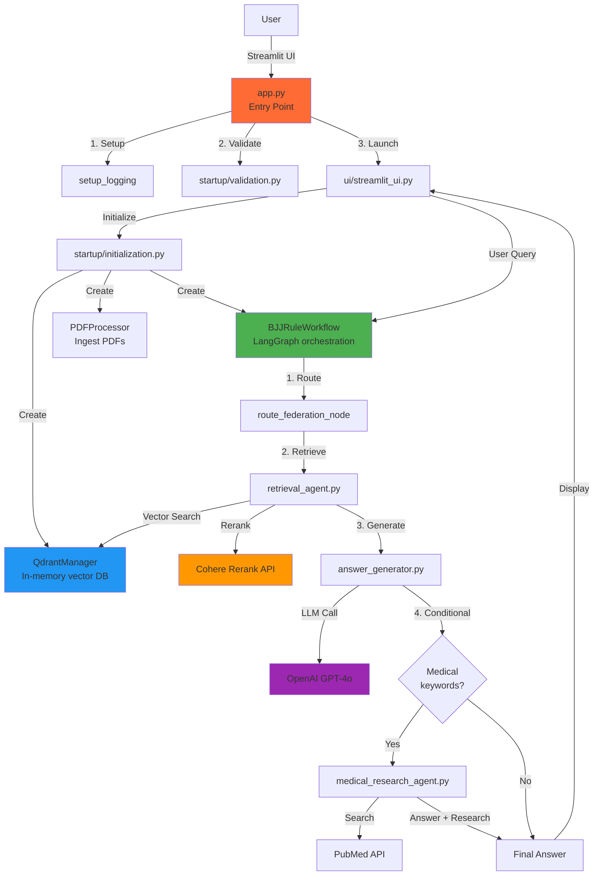

# CornerGuide Architecture Overview

**Last Updated:** 2026-01-02
**Status:** Current (reflects ADR-003 refactor)

---

## High-Level Architecture

CornerGuide is a **production-ready GenAI assistant** for Brazilian Jiu-Jitsu competition rules, built using modern RAG (Retrieval-Augmented Generation) patterns.

### System Diagram



---

## Module Boundaries

### **Entry Point Layer**

#### `app.py`
**Purpose:** Application entry point and initialization orchestration

**Responsibilities:**
- Set up structured logging
- Validate environment variables (API keys)
- Launch UI

**Key Functions:**
- `setup_logging()` - Configure Python logging
- `main()` - Entry point

**Dependencies:** `config.py`, `startup/`, `ui/`

---

### **Startup Layer** (`startup/`)

#### `startup/validation.py`
**Purpose:** Environment validation

**Responsibilities:**
- Check required environment variables exist
- Log validation failures
- Fail fast with clear error messages

**Key Functions:**
- `validate_environment() -> bool`

#### `startup/initialization.py`
**Purpose:** System initialization

**Responsibilities:**
- Create QdrantManager (vector database)
- Create PDFProcessor (ingest pipeline)
- Create BJJRuleWorkflow (orchestration)
- Process PDFs on first run
- Create vectorstore from chunks

**Key Functions:**
- `initialize_system() -> (BJJRuleWorkflow, QdrantManager)`

**Note:** Streamlit-cached for performance

---

### **UI Layer** (`ui/`)

#### `ui/streamlit_ui.py`
**Purpose:** All Streamlit UI logic

**Responsibilities:**
- Configure page and CSS
- Render header, query interface, footer
- Handle user interactions
- Display answers and medical research

**Key Functions:**
- `run_ui()` - Main UI entry point
- `configure_page()` - Page setup
- `render_query_interface()` - Input widgets
- `process_query()` - Handle user query
- `display_answer()` - Show results

---

### **Core Domain** (`src/`)

#### `src/models/`
**Purpose:** Domain models and enums

**Files:**
- `enums.py` - Federation, Category, BeltLevel, AnswerType
- `rules.py` - RuleChunk Pydantic model

#### `src/extraction/`
**Purpose:** PDF ingestion pipeline

**Files:**
- `pdf_processor.py` - Orchestrates PDF processing
- `processing_strategy.py` - Strategy pattern (Fast vs Structured)
- `text_extractor.py` - PyPDF2 and unstructured.io extractors
- `metadata_extractor.py` - Extract belt levels, techniques, federations
- `content_categorizer.py` - Classify content into categories

**Flow:** PDF → Text → Chunks → Metadata → RuleChunk[]

#### `src/vector_db/`
**Purpose:** Vector database management

**Files:**
- `qdrant_setup.py` - QdrantManager class

**Key Methods:**
- `create_from_chunks()` - Create vectorstore from RuleChunk[]
- `search_similar()` - Semantic search with filters

#### `src/agents/`
**Purpose:** RAG agents (retrieval, generation, research)

**Files:**
- `retrieval_agent.py` - Multi-query retrieval + Cohere reranking
- `answer_generator.py` - LLM-based answer synthesis
- `medical_research_agent.py` - PubMed research for safety

**Note:** `retrieval_agent.py` currently violates "retrieval should not call LLM" principle (see Phase 2 roadmap)

#### `src/orchestration/`
**Purpose:** LangGraph workflow orchestration

**Files:**
- `workflow.py` - BJJRuleWorkflow state machine

**Flow:** route_federation → retrieve_chunks → generate_answer → (conditional) research_medical

#### `src/evaluation/`
**Purpose:** RAG evaluation and testing

**Files:**
- `golden_dataset.py` - 15 test Q&A pairs
- `ragas_evaluator.py` - RAGAS metrics (faithfulness, relevancy, precision, recall)

---

## Data Flow

### User Query Flow

```
1. User enters question + selects federation
   ↓
2. ui/streamlit_ui.py::process_query()
   ↓
3. BJJRuleWorkflow.process_query()
   ├─ route_federation_node → Set federation filter
   ├─ retrieve_chunks_node → RetrievalAgent.retrieve()
   │  ├─ generate_fusion_queries() [LLM call #1]
   │  ├─ search_similar() [Qdrant vector search]
   │  └─ rerank_with_cohere() [Cohere API]
   │
   ├─ generate_answer_node → AnswerGeneratorAgent.generate_answer()
   │  └─ llm.invoke() [LLM call #2 - GPT-4o]
   │
   └─ (conditional) research_medical_node
      └─ MedicalResearchAgent.process_medical_research()
         ├─ assess_injury_potential() [LLM call #3]
         └─ search_pubmed() + analyze [LLM call #4]
   ↓
4. Display answer + sources + medical research
```

### PDF Ingestion Flow

```
1. PDFProcessor.process_all_pdfs()
   ↓
2. For each PDF:
   ├─ TextExtractor.extract() → raw text
   ├─ RecursiveCharacterTextSplitter → chunks
   ├─ MetadataExtractor → belt_level, technique, federation
   └─ ContentCategorizer → category
   ↓
3. QdrantManager.create_from_chunks()
   ├─ OpenAIEmbeddings.embed_documents()
   └─ Qdrant.from_documents() → in-memory vectorstore
   ↓
4. Ready for queries
```

---

## Technology Stack

| **Layer** | **Technology** | **Purpose** |
|---|---|---|
| **UI** | Streamlit 1.38.0 | User interface |
| **Orchestration** | LangGraph 0.2.28+ | Agentic workflow graphs |
| **LLM** | OpenAI GPT-4o | Answer generation |
| **Embeddings** | text-embedding-3-large | Semantic search (3072d) |
| **Vector DB** | Qdrant (in-memory) | Similarity search |
| **Reranking** | Cohere rerank-english-v3.0 | Result reranking |
| **PDF Processing** | PyPDF2 + unstructured | Text extraction |
| **Evaluation** | RAGAS | RAG metrics |
| **External APIs** | PubMed | Medical research |

---

## Target Architecture (Future)

**Current state:** Streamlit UI directly calls business logic

**Target state:** Add API layer for multi-client support

```
cornerguide/
├── api/                       # 🔮 FUTURE: FastAPI routes
│   ├── routes.py
│   └── schemas.py
├── ui/                        # ✅ Current: Streamlit
│   └── streamlit_ui.py
├── workflows/                 # ✅ Current: LangGraph orchestration
│   └── workflow.py
├── ingestion/                 # 🔮 FUTURE: Standalone CLI
│   └── cli.py
└── retrieval/                 # 🔮 FUTURE: Pure retrieval (no LLM)
    └── retrieval.py
```

See [CLAUDE.md](../../CLAUDE.md) for detailed target architecture.

---

## Key Design Principles

1. **Separation of Concerns**: UI, business logic, and data layers are independent
2. **Single Responsibility**: Each module has one reason to change
3. **Deterministic Retrieval**: Retrieval should not call LLMs (migration in progress)
4. **Testability**: All modules independently testable
5. **Observability**: Structured logging throughout (Phase 2)

---

## Related Documents

- [ADR-003: UI/Business Logic Separation](../decisions/003-ui-business-logic-separation.md)
- [CLAUDE.md](../../CLAUDE.md) - Project-specific AI agent instructions
- [README.md](../../README.md) - Getting started guide

---

## Maintenance Notes

**For AI Agents:**
- Key entry point: `app.py`
- Core RAG flow: `src/orchestration/workflow.py`
- Retrieval logic: `src/agents/retrieval_agent.py` (note: calls LLM for query expansion)
- Generation logic: `src/agents/answer_generator.py` (no DB access)
- UI logic: `ui/streamlit_ui.py` (all Streamlit code)

**For Developers:**
- Start reading: `app.py` → `ui/streamlit_ui.py` → `workflow.py`
- To add a new federation: See [guides/adding-federation.md](../guides/adding-federation.md) (TODO)
- To modify RAG flow: Edit `src/orchestration/workflow.py`
